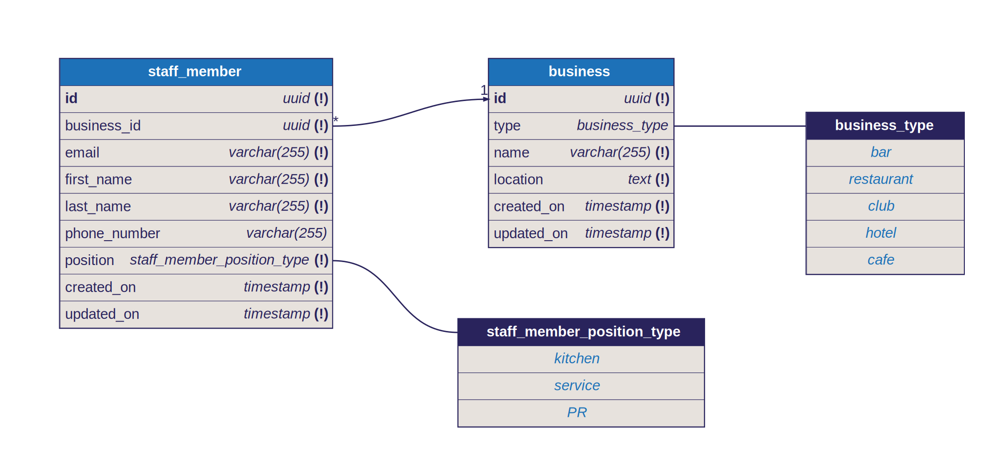

# Orthogonality Task

This was developed using NestJS and NextJS.

I used a monorepo structure using TurboRepo. Frontend and backend apps are in the `apps/` directory, and shared code is in the `libs/` directory

For the database ORM I opted for Drizzle. Schemas can be found in `apps/api/src/drizzle/schemas.ts`

### Running

You must have node, yarn and docker installed.

If you are running on Mac/Linux and/or have `make` installed:
- Run `make` in the same directory as the app
- Navigate to http://localhost:3001 in your browser

Otherwise:
- `docker-compose up -d`
- `yarn`
- `yarn db:migrate`
- `yarn dev`
- Navigate to http://localhost:3001 in your browser

### Database schema

### CI/CD and deployment plan

Included is a Dockerfile that makes it easy to build docker containers in a Turbo monorepo. All that's required in the docker build command is a `SCOPE` variable, referring to which app to build (`api` or `client`) and a `PORT` for port mappings.

This can be done easily from CI pipelines such as GitHub Actions.

Deployment can be done anywhere that supports docker.
